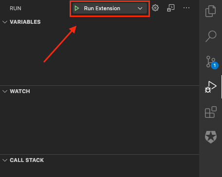

# Auth0 VSCode Extension

A Visual Studio Code extension that provides a rich IDE experience for setting up your Auth0 integration, and deploying changes to your Auth0 account.

## Requirements

You'll need an Auth0 account. If you do not already have one, you can create a free one [here](https://auth0.com/signup)

## Instalation

This Visual Studio Code extension is not yet published to the Extensions Marketplace. In order to install this extension, you must run `code --install-extension auth0-vsce-0.0.1.vsix` and close/open Visual Studio Code.

Complete commands:

```
git clone https://github.com/auth0/vscode-extension.git
cd vscode-extension
npm install
vsce package
code --install-extension auth0-vsce-0.0.1.vsix
```

## Uninstall
To remove the extension, run `code --uninstall-extension auth0-vsce-0.0.1.vsix`

## Contributing
To start contributing new features to the Auth0 VS Code extension, you can develop and debug the application locally. 

```
git clone https://github.com/auth0/vscode-extension.git
cd vscode-extension
npm install
```

Under the Debug Tab in Visual Studio Code, select `Run Extension`.



## Quick Start

### Authenticating

The first thing to do is connect to your Auth0 account.

<div align="center">
  <a href="https://auth0-1.wistia.com/medias/djjvi6h7ht">
 
  </a>
</div>


You can also log out, or switch your selected tenant

<div align="center">
  <a href="https://auth0-1.wistia.com/medias/dr73hybglz">
 
  </a>
</div>

### Managing Auth0 Resources

From within VSCode, you can now:

View your Applications and APIs, and also see or copy their pertinent details into your code

<div align="center">
  <a href="https://auth0-1.wistia.com/medias/ht4bd62rvx">
 
  </a>
</div>

Create or Update Applications, including setting up your applications to use a local callback URL for development purposes

<div align="center">
  <a href="https://auth0-1.wistia.com/medias/lyvhjrat86">
 
  </a>
</div>

### Advanced Auth0 Resource Updates

You can also take advantage of our `yaml` configuration integration to make more complex changes to your Auth0 resources, then deply them right from within VSCode.

<div align="center">
  <a href="https://auth0-1.wistia.com/medias/yx9li5sz1i">
 
  </a>
</div>

### Integrate With Auth0 Extensibility Points via Actions

The Auth0 VSCode extension has full support [Actions](https://auth0.com/docs/actions). Actions enables you to integrate your application with Auth0 events or Extensibility points. For example, you could create an Action to store some metadata everytime a user enters the wrong password.

You can create and deploy an Action

<div align="center">
  <a href="https://auth0-1.wistia.com/medias/55yw22sxdi">
 
  </a>
</div>

You can add dependencies and secrets to your Action

<div align="center">
  <a href="https://auth0-1.wistia.com/medias/wfwr0txb00">
 
  </a>
</div>

And much more!

## License

MIT

## Release Notes

---
