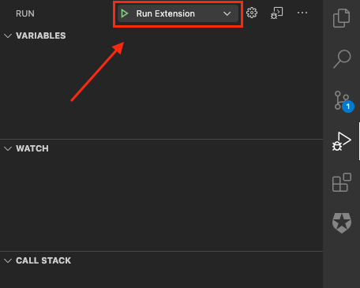

[![Auth0 Training][(https://cdn.auth0.com/website/auth0/labs/auth0-training-logo.png)](https://cdn.auth0.com/website/auth0/labs/auth0-training-logo.png) "Auth0 Training")](https://training.auth0.com)

---

[](https://marketplace.visualstudio.com/items?itemName=auth0.vscode-labs) [](https://opensource.org/licenses/MIT)

## Auth0 Labs VSCode Extension (Experimental)

A Visual Studio Code extension that provides a rich IDE experience for Auth0 Training Labs.

> Note: This extension is an experimental release, and is built on a best-efforts basis by some Auth0 developers in their available innovation time. It is open-source licensed and free to use, and is not covered by any Auth0 Terms of Service or Agreements. If you have issues with this extension you can engage with the project's developer community through the repository GitHub Issues list, or contribute fixes and enhancements of your own via a Pull Request.

### Requirements

You'll need an Auth0 account. If you do not already have one, you can create a free one [here](https://auth0.com/signup).

### Installation for VS Code

You can find the Auth0 Labs Visual Studio Code extension in the Visual Studio Marketplace. Click install to add the extension to your editor.

### Installation from source

In order to install this extension from source, you must run `code --install-extension release.vsix` and close/open Visual Studio Code.

Complete commands:

```
git clone https://github.com/auth0-training/labs-vscode-extension.git
cd labs-vscode-extension
npm install
npm run build:production
npm run package
code --install-extension release.vsix
```

### Uninstall
To remove the extension, run `code --uninstall-extension release.vsix`

### Contributing
To start contributing new features to the Auth0 Labs VSCode extension, you can develop and debug the application locally. 

```
git clone https://github.com/auth0-training/labs-vscode-extension.git
cd labs-vscode-extension
npm install
```

Under the Debug Tab in Visual Studio Code, select `Run Extension`.


## Features
---
## Alternative Root Tenant Authority
If you are attempting to work on labs for Layer0 based cloud environments, you can tell the extension to use an alternate root tenant by passing the following environment variables.

- **VSCODE_EXTENSION_ISSUER** - Default:`https://auth0.auth0.com` The root tenant authority to use.
- **AUTH0_VSCODE_EXTENSION_CLIENT_ID** - Default: `w94YV1qvYFMH2PnmFSIQVxkGJwk0tBGt` The client id that was created specifically for the extension with the alternative root tenant authority.
- **AUTH0_VSCODE_EXTENSION_AUDIENCE** - Default: `https://*.auth0.com/api/v2/` The Management API audience specific to your environment. **Note:** The wild card tenant segment is required. This enables the RTA to prompt the user for a specific tenant to authorize.
### Contributed Commands
In addition to the visual features listed below, the Labs extension also contributes the following commands to the command palette:

- **Auth0: Sign In** - `auth0.auth.signIn` Starts the authentication process.
- **Auth0: Sign Out** - `auth0.auth.signOut` Clears all authentication tokens.
- **Auth0: Switch Tenant** - `auth0.auth.switchTenant` Clears all authentication tokens and starts the authentication process allowing the selection of a new tenant.
- **Auth0: Add Application** - `auth0.app.add` Starts a wizard to create a new client registration in the current Auth0 tenant.
- **Auth0: Add API** - `auth0.api.add` Starts a wizard to create a new resource server registration in the current Auth0 tenant.
- **Auth0: Configure Lab** - `auth0.lab.configure` Configures tenant and local environment for the current lab materials. Only available when lab materials are present in workspace.
- **Auth0: Configure Local Environment** - `auth0.lab.localConfigure` Configures local environment for the current lab materials. Only available when lab materials are present in workspace.
- **Auth0: Configure Tenant Resources** - `auth0.lab.tenantConfigure` Configures tenant for the current lab materials. Only available when lab materials are present in workspace.
- **Auth0: Export Tenant** - `auth0.exportTenant` Exports tenant configuration yml to the root directory. This exports everything and needs to be edited down for a lab. 
- **Auth0: Open Endpoint Url** - `auth0.lab.openEndpointByName?["Endpoint 1, Endpoint 2"]` Opens the URL associated with a specific named endpoint in the default browser. Multiple endpoints can be opened by supplying a comma-separated list. Only available when lab materials are present in the workspace.
- **Auth0: Run Post Configure Command** `auth0.lab.postConfigureCommand` Allows you to specify the path of a shell script in `environment.json` (i.e., `"postConfigureCommand": "<script-path>"`), that will execute upon configuration completion. Enables you to run a script to perform actions like storing values client id and client secret as secrets in the environment. This command currently has access to the following environment variables:
  - `AUTH0_DOMAIN`: Your Auth0 domain URI
  - `AUTH0_TOKEN`: The access token issued to your client from the authorization server.

### Authenticating

The first thing to do is connect to your Auth0 account.

<div align="center">
  <a href="https://auth0-1.wistia.com/medias/djjvi6h7ht">
 
  </a>
</div>


You can also log out, or switch your selected tenant

<div align="center">
  <a href="https://auth0-1.wistia.com/medias/dr73hybglz">
 
  </a>
</div>

### Managing Auth0 Resources

From within VSCode, you can now:

View your Applications and APIs, and also see or copy their pertinent details into your code

<div align="center">
  <a href="https://auth0-1.wistia.com/medias/ht4bd62rvx">
 
  </a>
</div>

Create or Update Applications, including setting up your applications to use a local callback URL for development purposes

<div align="center">
  <a href="https://auth0-1.wistia.com/medias/lyvhjrat86">
 
  </a>
</div>

### Advanced Auth0 Resource Updates

You can also take advantage of our `yaml` configuration integration to make more complex changes to your Auth0 resources, then deploy them right from within VSCode.

<div align="center">
  <a href="https://auth0-1.wistia.com/medias/yx9li5sz1i">
 
  </a>
</div>

### Contributing
---

Please check the [contributing guidelines](CONTRIBUTING.md).

### What is Auth0?
---

Auth0 helps you to:

* Add authentication with [multiple authentication sources](https://auth0.com/docs/identityproviders), either social like **Google, Facebook, Microsoft Account, LinkedIn, GitHub, Twitter, Box, Salesforce, among others**, or enterprise identity systems like **Windows Azure AD, Google Apps, Active Directory, ADFS or any SAML Identity Provider**.
* Add authentication through more traditional [username/password databases](https://auth0.com/docs/connections/database/custom-db).
* Add support for [linking different user accounts](https://auth0.com/docs/link-accounts) with the same user.
* Support for generating signed [JSON Web Tokens](https://auth0.com/docs/jwt) to call your APIs and **flow the user identity** securely.
* Analytics of how, when, and where users are logging in.
* Pull data from other sources and add it to the user profile, through [JavaScript rules](https://auth0.com/docs/rules/current).

### Issue Reporting
---
If you have found a bug or if you have a feature request, please report them at this repository issues section. Please do not report security vulnerabilities on the public GitHub issue tracker. The [Responsible Disclosure Program](https://auth0.com/whitehat) details the procedure for disclosing security issues.

### Author
---

[Auth0](https://auth0.com)

### License
---

This project is licensed under the MIT license. See the [LICENSE](LICENSE.txt) file for more information.
